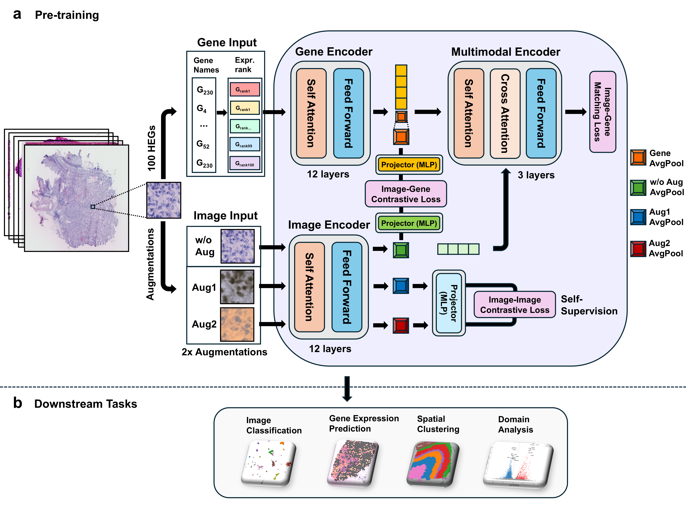

# ST-ConMa



## 💽 Datasets for downstream tasks

- **Camelyon17-WILDS**: [https://huggingface.co/datasets/wltjr1007/Camelyon17-WILDS]
- **NCT-CRC-HE-100K**: [https://zenodo.org/records/1214456]
- **WSSS4LUAD**: [https://wsss4luad.grand-challenge.org/]
- **MHIST**: [https://bmirds.github.io/MHIST/]
- **HER2ST**: [https://zenodo.org/records/4751624]
- **cSCC**: GSE144240 (via GEO)
- **HLT**: GSE240429 (via GEO)
- **DLPFC**: [http://spatial.libd.org/spatialLIBD]
- **Human breast cancer**: [https://www.10xgenomics.com/datasets/human-breast-cancer-block-a-section-1-1-standard-1-1-0]
---

## Encoders for ST-ConMa

### Image Encoder

- **PathoDuet**: [https://github.com/openmedlab/PathoDuet]

### Gene Encoder

- **Pythia410M (C2S)**: [https://huggingface.co/vandijklab/C2S-Pythia-410m-diverse-single-and-multi-cell-tasks]

---

## 🗂️ Project Structure

```
ST_ConMa_git/
├── train_multitask.py              # Main multi-task training script
├── run_train_multitask.sh          # Distributed training launcher
│
├── PathoDuet/
│   ├── checkpoint/
│       ├── checkpoint_HE.pth                    
│
├── utils/                          # Core training utilities
│   ├── multimodal.py               # ST_AlignmentModel & Trainer
│   ├── loss.py                     
│   ├── dataset_load.py           
│   ├── augmentations.py           
│   ├── model.py                   
│   ├── optimizer.py                
│   ├── scheduler.py               
│   ├── gather.py                   
│   └── pt_load_inference.py        
│
├── pt_dataset/                     # Pre-training datasets
│   ├── st_images/                  # ST tissue images
│   └── st_sentences/               # Gene sentences
│
├── ft_dataset/                     # Fine-tuning datasets
│   ├── gep_pred/                   # Gene expression prediction
│   ├── spatial_clustering/         # Spatial clustering (DLPFC)
│   └── linear_probing/             # Linear probing benchmarks
│       ├── crc
│       ├── mhist
│       └── luad
│
├── evaluations/                    # Evaluation scripts
│   ├── gep_pred/                   # Gene expression prediction
│   │   ├── eval_st_conma_zeroshot.py
│   │   ├── train_st_conma.py
│   │   └── run_st_conma_*.sh
│   ├── linear_probing/             # Linear probing tasks
│   │   ├── cam17.py
│   │   ├── crcnorm.py
│   │   ├── luad.py
│   │   └── mhist.py
│   ├── spatial_clustering/         # Spatial domain identification
│   ├── st_linear_probing/          # ST-specific linear probing
│   └── cluster_plot/               # Visualization utilities
│
├── checkpoints/                    # Saved model weights
└── results/                        # Evaluation results
```

## 🌏 Environment Setup

Two conda environments are required:

```bash
# For dataset download and preprocessing
conda env create -f hest_env.yml
conda activate hest
pip install --no-deps -r hest_pip.txt

# For gene expression prediction and spatial clustering fine-tuning 
conda env create -f st_conma_env.yml
conda activate st_conma
pip install --no-deps --extra-index-url https://download.pytorch.org/whl/cu124 -r st_conma_pip.txt

# For spatial clustering with STAIG module
conda env create -f st_conma_clustering_env.yml
conda activate st_conma_clustering
pip install --no-deps --extra-index-url https://data.pyg.org/whl/torch-2.2.0+cu121.html -r st_conma_clustering_pip.txt
```

---

## 🚀 Dataset Preparation

### 1. Download HEST-1K Dataset

```bash
conda activate hest
python ./pt_dataset/st_download.py
python ./pt_dataset/patches_download.py
python ./extract_patches.py
```

### 2. Preprocessing

Run all cells in `./pt_dataset/profiling_and_preprocessing.ipynb`.

---

## Pre-training

```bash
conda activate st_conma
bash run_train_multitask.sh
```

---

## Evaluation

> **Note:** Adjust the CUDA device in each script as needed.

### K-means Clustering on Histopathology Benchmarks

```bash
python ./evaluations/cluster_plot/cluster_plot_st_conma.py
```

### Linear Probing on Histopathology Benchmarks

```bash
python ./evaluations/linear_probing/cam17.py
python ./evaluations/linear_probing/crcnorm.py
python ./evaluations/linear_probing/luad.py
python ./evaluations/linear_probing/mhist.py
```

### Gene Expression Prediction

Evaluated on **HER2ST**, **cSCC**, and **HLT** datasets.

```bash
bash ./evaluations/gep_pred/run_st_conma_igc_igm.sh
bash ./evaluations/gep_pred/run_st_conma_zeroshot.sh
```

For visualization, run all cells in:

- `./evaluations/gep_pred/CD24_viz.ipynb`
- `./evaluations/gep_pred/LGALS1_viz.ipynb`

### Linear Probing on DLPFC Dataset

```bash
python ./evaluations/st_linear_probing/train_st_conma_ie_dlpfc.py
python ./evaluations/st_linear_probing/train_st_conma_ge_dlpfc.py
python ./evaluations/st_linear_probing/train_st_conma_fe_dlpfc.py
```

### Spatial Clustering

Evaluated on **DLPFC** and **Human Breast Cancer** datasets.

```bash
# Fine-tuning
bash ./evaluations/spatial_clustering/run_finetune_dlpfc.sh
bash ./evaluations/spatial_clustering/run_finetune_hbc.sh

# Extract fusion embeddings
bash ./evaluations/spatial_clustering/run_get_fusion_embeddings_dlpfc.sh
bash ./evaluations/spatial_clustering/run_get_fusion_embeddings_hbc.sh

# Clustering with STAIG module
python ./evaluations/spatial_clustering/train_st_conma.py \
    --dataset dlpfc --all \
    --output_dir ./results/spatial_clustering/st_conma/dlpfc

python ./evaluations/spatial_clustering/train_st_conma.py \
    --dataset human_breast_cancer --all \
    --output_dir ./results/spatial_clustering/st_conma/human_breast_cancer
```

### Human Breast Cancer Analysis

Run all cells in `./evaluations/spatial_clustering/spatial_clustering.ipynb`.
